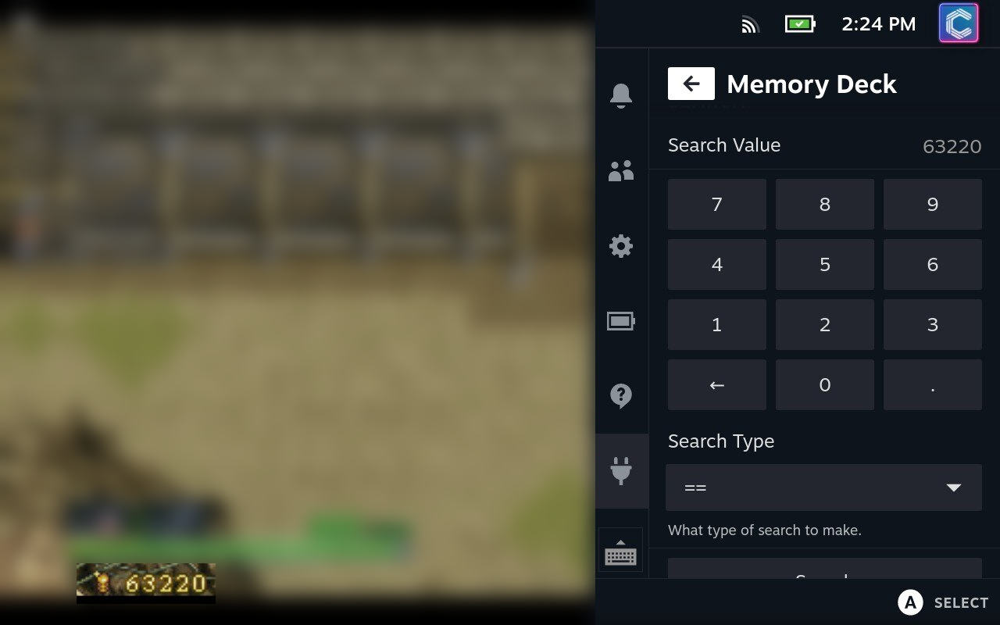

# Memory Deck

A scanmem wrapper in a [decky-loader](https://github.com/SteamDeckHomebrew/decky-loader) plugin.

This plugin allows you to scan for, and edit values in memory. Akin to something like [Cheat Engine](https://cheatengine.org).

## How to Use

### Selecting a Process

When first opening Memory Deck, you will need to select a process. The plugin will automatically load a list of processes for you when opened.

If you need to reload the process list for any reason, simply press the `Reload Process List` button.

You will need to do this after closing / opening processes after Memory Deck has been opened.

#### Changing Process

After a process has been selected, you can change it by pressing the `Choose Another Process` button.

### Finding a Value

To find a value in memory, a number of searches need to be performed in sequence.
Each search should ideally change something to narrow the search down further and further, until eventually hopefully reaching just a single value (or at least a small enough list to manually check).

#### Search Operators

When searching for a value, you can use the following operators:

| Operator     | Description                                                                       |
| ------------ | --------------------------------------------------------------------------------- |
| ==           | The value in memory*exactly matches* the search value.                         |
| !=           | The value in memory*does not match* the search value.                          |
| &gt;         | The value in memory is greater than the search value.                             |
| &lt;         | The value in memory is less than the search value.                                |
| Not Changed  | The value in memory has**not** changed since the last search.               |
| Changed      | The value in memory*has* changed since the last search.                        |
| Increased    | The value in memory has*increased* since the last search.                      |
| Decreased    | The value in memory has*decreased* since the last search.                      |
| Increased By | The value in memory has*increased* by the search value since the last search.  |
| Decreased By | The value in memory has*decreased* by the search value since the last search.  |

Your first search should probably be a `==` search, as this will find all values that match the search value.

#### Running the Search

Once you have entered your search value and operator. Press the `Search` button to run the search.

This will ask the backend to run the scan you've selected.

Once the process is complete, you will be able to see the number of matches found at the bottom of the QAM.

Keep repeating searches until there are less than *10* matches left.

### Editing Values
Once there are less than 10 matches, a new section will appear at the bottom of the QAM.

This section will list every match address, with a `Change` button.

You can enter a new value with the `New Value` field, and press the `Change` button to change the value at that address.

### Resetting a Scan
If you want to reset the scan, you can press the `Reset Scan` button at the top of the page.
This will reset the scan and empty out all known values. This allows you to then start another initial scan.

## Installation
Install [Decky Loader](https://github.com/SteamDeckHomebrew/decky-loader) using their instructions.
You should then be able to find Memory Deck in the Decky store!